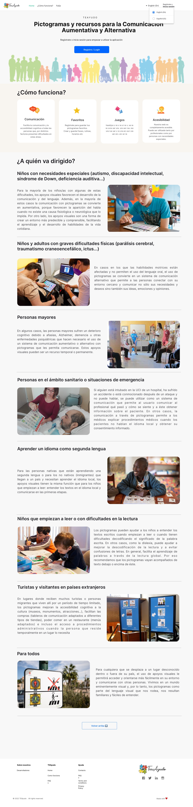
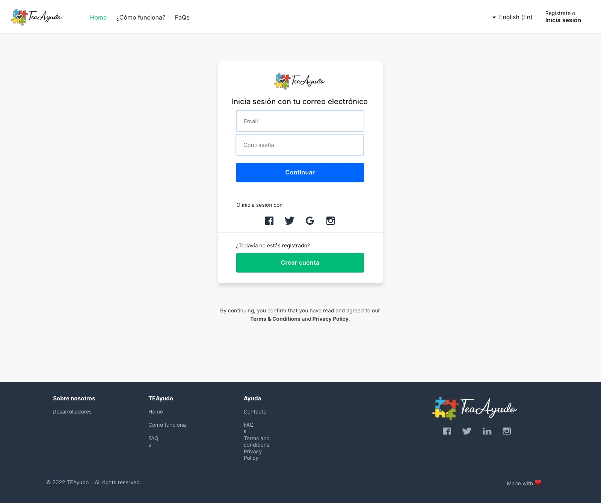
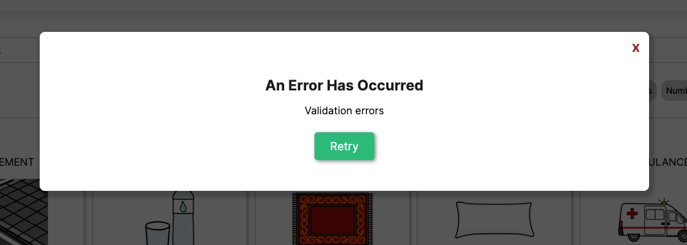

# Final Project [General Assembly](https://https://generalassemb.ly/)

For this project, we have drawn on our own personal experience. We have developed a website in which a user can use pictograms to communicate with other users.

We also give you the option to register and have more advanced functions or, alternatively, to log in as a guest and use your local machine.

## Live Demo

- [teayuda.netlify.app](https://teayuda.netlify.app/)

## UI Wireframe Design

For the design we have based ourselves on a template from the site [Sketch app Sources](https://www.sketchappsources.com/), specifically [Online Tutoring Website Concept](https://www.sketchappsources.com/free-source/4729-tutoring-services-website-concept-sketch-freebie-resource.html).

- Home
  
- Login
  
- Dashboard
  
- Details
  

## Deployment with Netlify

For deployment we use [Netlify](https://www.netlify.com/), offering hosting and serverless backend services for web applications and static websites.

To get started with manual deploys

```bash
  netlify deploy
```

To do a production deploy

```bash
  netlify deploy --prod
```

## Run Locally

Clone the project

```bash
  git clone https://github.com/Lyanna666/proyecto-final-GA
```

Go to the project directory

```bash
  cd Pictogramas
```

Install dependencies

```bash
  npm install
```

Start the server

```bash
  npm run start
```

### Tree Directory

```───src
    ├───api
    ├───components
    │   ├───aside
    │   ├───elements
    │   ├───Error
    │   ├───Favorites
    │   ├───Footer
    │   ├───Header
    │   ├───HeaderMenu
    │   ├───Home
    │   ├───loading
    │   ├───pagination
    │   ├───Pictograms
    │   └───table
    ├───Constants
    ├───pages
    ├───styles
    └───Utils
```

## API Reference

#### Get all items

```http
  GET /api/items
```

```
  https://api.arasaac.org/api/pictograms
```

| Parameter | Type     |
| :-------- | :------- |
| `api_key` | `string` |

#### Code

- Constants with the different `URL` we are going to use.

```
const urlGlobal = 'https://api.arasaac.org/api/pictograms';
const urlAll = '/all/';
const urlBest = '/bestsearch/';
const urlSearch = '/search/';
```

- Request with `asynchronous function` and `fetch`.

```JavaScript
export async function fetchAllPictograms(language) {
  try {
    const response = await fetch(urlGlobal + urlAll + language, {
      method: 'GET',
    });
    const pictograms = await response.json();
    return pictograms;
  } catch (error) {
    console.error({ error });
    return error;
    // alert('Ha ocurrido un error:', error);
  }
}
```

- Example of error when request fails

  


```JavaScript
describe('Error', () => {

  const ERROR_TITLE = 'Ha ocurrido un error';
  const ERROR_LOGIN =
    'Esta funcionalidad todavía no está implementada en la versión actual de la aplicación.';

  it('render error when click on Login', () => {
    render(
      <Error title={ERROR_TITLE} errorProps={ERROR_LOGIN} />,
      {
      },
    );

    const title = screen.getByText(ERROR_TITLE);
    const errorText = screen.getByText(ERROR_LOGIN);

    expect(title).toBeInTheDocument();
    expect(errorText).toBeInTheDocument();
  });
});
```

## Framework

- [react-router-dom](https://www.npmjs.com/package/react-router-dom)
- [styled-components](https://www.npmjs.com/package/styled-components)
- [react-test-renderer](https://www.npmjs.com/package/react-test-renderer)

## Authors :octocat:

- [@jacobo87](https://www.github.com/jacobo87)
- [@Lyanna666](https://github.com/Lyanna666/)
